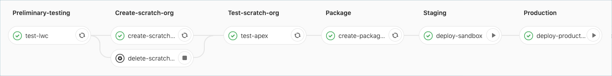
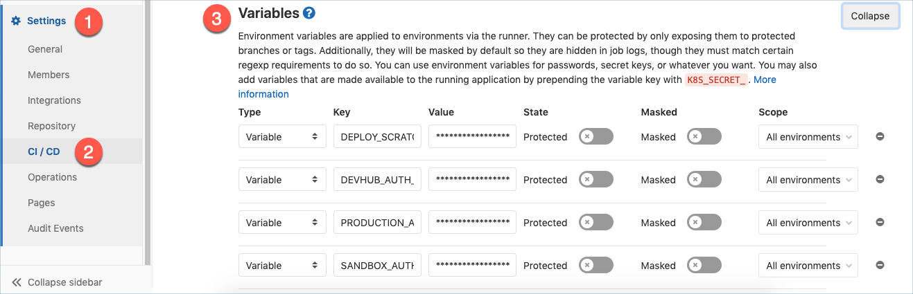

# GitLab CI/CD for Salesforce

This project contains a fully configured CI pipeline that works with Salesforce DX projects following the [package development model](https://trailhead.salesforce.com/en/content/learn/modules/sfdx_dev_model).
You can include a copy of, or import, this project's .yml file in your own project.
For a quick start example, please refer to [sfdx/sfdx-project-template](https://gitlab.com/sfdx/sfdx-project-template).

# What It Does

The CI pipeline for Salesforce is configured to create a scratch org and run tests of your Salesforce app every time you make a commit.
If tests pass, then the CI pipeline will create a new unlocked package version. You then have the option to manually approve the change
and deploy the new package version into your sandbox and production environments.



There are 6 stages to this pipeline:

1. **Preliminary Testing**: For unit tests that can run in the context of a runner, without deployment to a scratch org. By default, this stage runs [Jest tests](https://developer.salesforce.com/docs/component-library/documentation/lwc/lwc.testing) for [Lightning Web Components](https://trailhead.salesforce.com/en/content/learn/trails/build-lightning-web-components), if they exist.
2. **Create Scratch Org**: Checks if you are within your daily scratch org limits, then creates a new scratch org and deploys the app metadata to it. Note there is also a "delete scratch org" job which can be run manually to remove and clean up leftover scratch orgs.
3. **Test Scratch Org**: Runs tests on the scratch org, such as Apex tests. At this point your team can conduct manual testing in the scratch org.
4. **Package**: Create a new unlocked package version for deployment to sandbox and production orgs. Only runs in the master branch.
5. **Staging**: Deploy to a pre-production org, such as a sandbox. This is a manual job which must be triggered by pressing the button, and only runs in the master branch.
6. **Production**: Promote the app and deploy to production. This is a manual job which must be triggered by pressing the button, and only runs in the master branch.

# Setting Up Your Project

1. Obtain a [Dev Hub](https://trailhead.salesforce.com/content/learn/projects/quick-start-salesforce-dx?trail_id=sfdx_get_started) org, which is required for creating scratch orgs in the CI pipeline. For testing, you can use a free [Trailhead Playground](https://trailhead.salesforce.com/content/learn/modules/trailhead_playground_management?trail_id=learn_salesforce_with_trailhead) or free [Developer Edition](https://developer.salesforce.com/signup) org.
2. In your Dev Hub org, enable both features [Dev Hub](https://developer.salesforce.com/docs/atlas.en-us.sfdx_setup.meta/sfdx_setup/sfdx_setup_enable_devhub.htm) and [Second-Generation Packaging](https://developer.salesforce.com/docs/atlas.en-us.sfdx_setup.meta/sfdx_setup/sfdx_setup_enable_secondgen_pkg.htm).
3. [Create](#create-an-unlocked-package) an unlocked package.
4. [Create](https://docs.gitlab.com/ee/gitlab-basics/create-project.html) a new GitLab project or [import](https://docs.gitlab.com/ee/user/project/import/repo_by_url.html) our quick start [sfdx/sfdx-project-template](https://gitlab.com/sfdx/sfdx-project-template).
5. [Configure](#configure-environment-variables) CI/CD environment variables in your GitLab project.
6. [Clone](https://docs.gitlab.com/ee/gitlab-basics/command-line-commands.html) your project locally.
7. Add your Salesforce DX source to your local GitLab project then commit and push the changes to the `master` branch, which will initiate the CI pipeline.

# Create an Unlocked Package

The package stage of the CI pipeline will automatically create new package versions. You can manually click a button in the pipeline to install the packages into downstream Salesforce environments. Before running the pipeline, you need to have created the package definition and update your `sfdx-project.json` file to reference it.

1. From your project directory, [create an unlocked package](https://trailhead.salesforce.com/en/content/learn/projects/quick-start-unlocked-packages) using the [sfdx force:project:create](https://developer.salesforce.com/docs/atlas.en-us.sfdx_dev.meta/sfdx_dev/sfdx_dev_dev2gp_create_pkg.htm) command. You only need to do this once per package/project.

2. Ensure your `sfdx-project.json` file mentions the package name and initial version number scheme in the `packageDirectories` property, and that the package name and ID (0Ho) are defined in the `packageAliases` property.

    An example `sfdx-project.json` file:
    ```json
    {
        "packageDirectories": [
            {
                "path": "force-app",
                "default": true,
                "package": "YOUR_PACKAGE_NAME",
                "versionNumber": "1.0.0.NEXT"
            }
        ],
        "namespace": "",
        "sourceApiVersion": "46.0",
        "packageAliases": {
            "YOUR_PACKAGE_NAME": "0HoXXXXXXXXXXXXXXX"
        }
    }
    ```

Once set, you don't have to manage the `versionNumber` property in `sfdx-project.json`. The CI pipeline determines the next appropriate version number automatically. Once a package version number has been released, the CI pipeline will create new package versions with a minor version number one greater than the latest released version.

For example, if the latest released version number is 1.2.0.5, then the next time the CI pipeline creates a new package version then it'll automatically compute the new version number to be 1.3.0.1.

# Configure Environment Variables

To use GitLab CI, you need to authenticate the GitLab project to your orgs in Salesforce.

1. Install [Salesforce CLI](https://developer.salesforce.com/tools/sfdxcli) on your local machine.
2. [Authenticate using the web-based oauth flow](https://developer.salesforce.com/docs/atlas.en-us.sfdx_dev.meta/sfdx_dev/sfdx_dev_auth_web_flow.htm) to each of the orgs that represent your Dev Hub, sandbox, and production org. **Note, for initial testing of GitLab CI, your "sandbox" and "production" orgs can be Trailhead Playgrounds or any Developer Edition org.**
3. Use the `sfdx force:org:display --targetusername <username> --verbose` command to get the [Sfdx Auth Url](https://developer.salesforce.com/docs/atlas.en-us.sfdx_dev.meta/sfdx_dev/sfdx_dev_auth_view_info.htm) for your various orgs. The URL you're looking for starts with `force://`. **Note, you must use the `--verbose` argument to see the Sfdx Auth URL.**
4. Populate the variables under **Settings > CI / CD > Variables** in your project in GitLab.



Here are the Auth URL variables to set:

- `DEVHUB_AUTH_URL`
- `SANDBOX_AUTH_URL`
- `PRODUCTION_AUTH_URL` (if your prod org is the same as your Dev Hub, then this can ommitted and the DEVHUB_AUTH_URL will be used by default)

Here are some other variables that are optional:

- `DEPLOY_SCRATCH_ON_EVERY_COMMIT`: "true" to deploy a scratch org on every commit in a merge request, otherwise it won't.
- `PACKAGE_NAME`: Optional. Must match one of the `packageDirectories` entries in `sfdx-project.json`. If not present, then the CI pipeline uses the default package directory from `sfdx-project.json`.
- `SALESFORCE_DEPLOYMENT_APPROACH` : Optional variable. The default value is assumed to be `PACKAGING`. Pipelines without this variable set or set to `PACKAGING` explicitly will execute creating a versioned unlocked package and deploying it into salesforce orgs. If you would like to only push application meta-data in the `/force-app` directory and not create an unlocked package, then set the value of this variable to `ORG_BASED`.  

Optionally, disable entire jobs with the following boolean variables:

- `TEST_DISABLED`
- `SCRATCH_DISABLED`
- `SANDBOX_DISABLED`
- `PRODUCTION_DISABLED`
